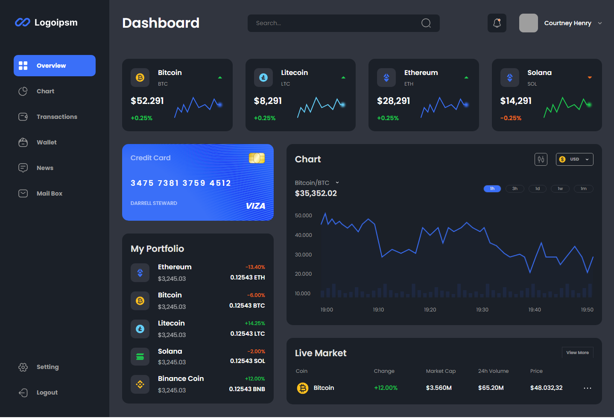

# Wallet Management Dashboard - Desktop

## Overview

The Wallet Management Dashboard is a desktop-oriented web application designed to help users manage their financial transactions and view their financial status. This project was created using HTML and CSS and features a clean and structured design tailored for desktop use.

## Live Demo

Check out the live demo here: [Live Demo](https://nureddinhaji.github.io/wallet-managment-dashbord/)

## Screenshot



## Project Contents

-   `index.html`: The main file that contains the structure of the dashboard.
-   `styles.css`: The CSS file that contains the styles and layout for the dashboard.

## How to Use

1.  **Clone the Repository:** You can clone this repository to your local machine using the following command:
    
```bash
git clone https://github.com/nureddinhaji/wallet-managment-dashbord.git
```

2. **Open the File:** After cloning, open the `index.html` file in your web browser to view the dashboard.
    
## Contributions

Contributions and improvements are welcome! Feel free to open a new issue on the [Issues](https://github.com/nureddinhaji/wallet-managment-dashbord/issues) page or submit a pull request.

## Contact

For more information or inquiries, you can reach me via email or through my social media profiles:

-   **LinkedIn:** [Nureddin Haji](https://www.linkedin.com/in/nureddinhaji)
-   **Twitter:** [@NureddinHaji](https://twitter.com/NureddinHaji)
-   **GitHub:** [nureddinhaji](https://github.com/nureddinhaji)
